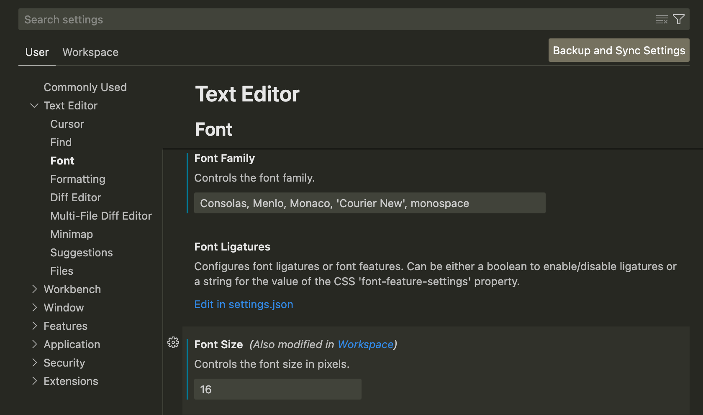

## 自定义VSCode外观

### Font

- 点击页面左下角齿轮图标进入"Settings", 在左侧栏选择font

- 在 "Font Size" 中调整字体大小

- 在 "Font Family" 中设置字体: 建议选择等宽字体. e.g. `Consolas`, `Monaco`, `Menlo`, 也可以在nerd font中浏览更多字体  
  如果需要设置备用字体, 可以用逗号隔开. e.g. `Consolas, monospace`

### Theme

- 左下角 "Settings" -> "Themes" -> "Color Theme"

- 出现下拉菜单后使用上下方向键可预览主题, 或可在extension中搜索安装更多主题

- 除了颜色主题，你还可以自定义文件图标主题，让你的 VS Code 界面更加个性化