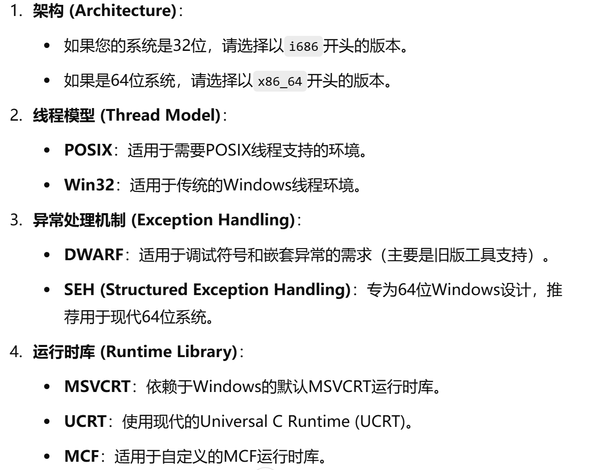
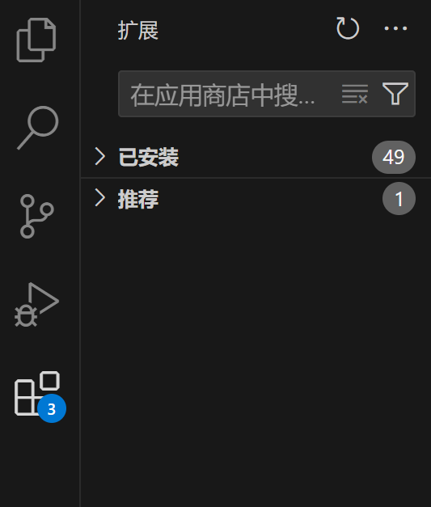
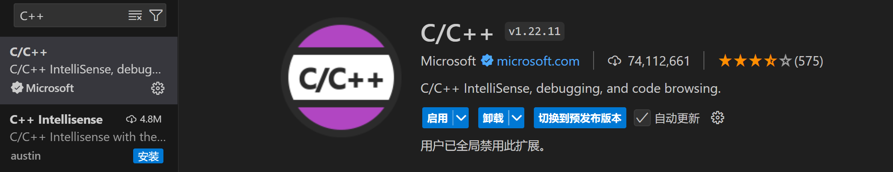
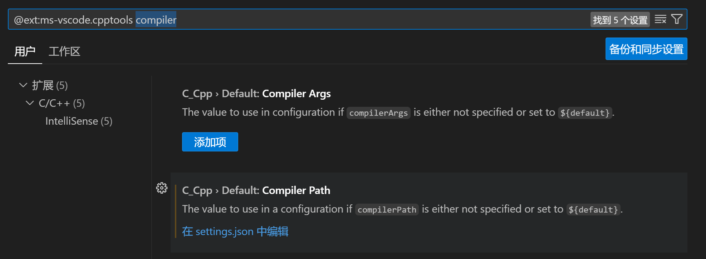

## 配置C/C++ 编译器

### windows

- 下载MinGW [MinGW](https://github.com/niXman/mingw-builds-binaries/releases)并根据自己电脑的版本选择合适的压缩包 
- 解压安装包并安装，记录安装路径
- 配置环境变量
    - 右键`此电脑` -> `属性` -> `高级系统设置` -> `环境变量`
    - 在系统变量中找到`PATH`，点击`编辑`
    - 新建添加MinGW-w64的bin目录路径，例如`D:\Program\mingw64\bin`
- 打开终端输入
    ```bash 
    gcc --version
    g++ --version
    gdb --version
    ```
    若出现了版本提示，则安装成功

### Linux

- 打开终端，输入 
    ```bash 
    gcc --version
    g++ --version
    gdb --version
    ```
    若出现了版本提示，可跳过安装编译器部分
- 未出现版本信息，则运行
    ```bash
    sudo apt install g++
    sudo apt install gcc
    sudo apt install gdb
    ```
- 出现安装请求提示时，键入 y 并按回车，完成安装

## VSCode C/C++ 插件

### 安装插件

- 打开扩展-应用商店 
- 搜索C++，安装图示插件 

### 配置插件

- 点击右侧齿轮按钮，选择设置
- 搜索 compiler， 找到Compiler Path, 选择 在设置中编辑
- 在终端中输入
    ```bash
    where.exe g++
    ```
    (windows)
    ```bash
    whereis g++
    ```
    (linux/mac)
- 将找到的g++路径写入settings.json的 **"C_Cpp.default.compilerPath": ""** (windows需要在每个反斜杠处多加一个反斜杠，示例： **"C_Cpp.default.compilerPath": "D:\\Program\\mingw64\\bin\\g++.exe",**)
