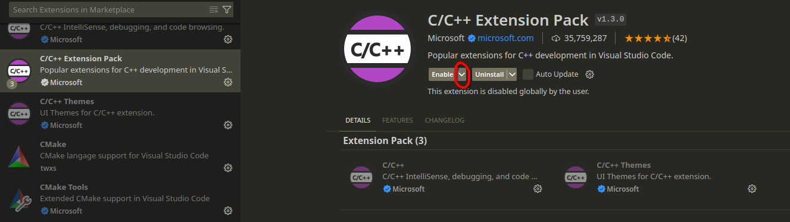
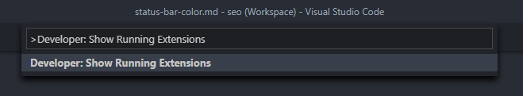
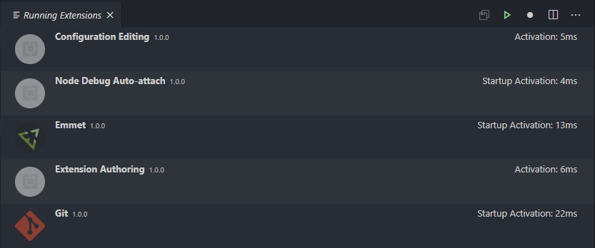

# Make VSCode Faster

VSCode gets slower and slower after installing lots of extensions. The latency is due to the loading time of extensions, thus extension should be enabled minimally.

## Update your VSCode

VSCode is developed by Microsoft and open-source enthusiasts from all over the world. There are pull requests every minute, quite a lot of them trying to improve performance. Updating VSCode regularly ensures you can get the best coding experience.

## Do not install too much extensions

The problem may be one of quantity. If you have 20+ extensions installed, it may be a good idea to disable some less necessary ones and see if it makes a difference. (This is probably a good practice anyway)

## Only enable necessary extensions for the workspace

- VSCode should be opened by workspace, instead of double-clicking on a file in file explorer. If double-clicking on a file to open VSCode, lots of features will be unavailable.
- Ways of opening VSCode by workspace:
  - Enter the directory of the project in terminal, and run `code .` (Require adding code to PATH during installation. This is by default set.), where the `.` means open the current folder
  - Open VSCode and select `File->Open Folder` and choose the folder of the project
  - On Windows, if you select `Add Code to context menu`, meaning that Code is added to the right-click menu of file explorer, you can navigate to the project folder in file explorer, right click on the blank background and choose `Open with Code` (May require selecting `More options` on Windows 11)
- Disable **ALL** extensions in the extension bar. You can leave some extensions that you use everywhere enabled (e.g. Github Copilot, Github Copilot Chat, Background-cover, Prettier - Code formatter, Remote - SSH, Remote Explorer, etc.) Disable **ALL** others extensions.
- Enable extensions by workspace: In a c++ project, open the extension bar, select `C/C++ Extension Pack` (This pack includes C/C++, C/C++ Themes, CMake and CMake Tools.), click the drop-down menu *besides* `Enable`, and select `Enable (Workspace)`.
  - In a C/C++ workspace, recommended extensions to enable by workspace are `C/C++ Extension Pack` (including C/C++, C/C++ Themes, CMake and CMake Tools).
  - In a python workspace, recommended extensions to enable by workspace are `Python` (including Python, Pylance, Python Debugger) and black/yapf.
  - In a frontend workspace, recommended extensions to enable by workspace are `Prettier - Code formatter`, the extension of the corresponding framework (Vue, React, etc.)

- Then in a C++ project workspace, python extensions will not be loaded. Every time you open this workspace again, the extensions you enabled now (by workspace) will be auto enabled.

## Inspect time of all extensions (including integrated ones)

[Make VSCode faster](https://vscode.one/make-vscode-faster/)

### Check for slow-starting extensions

VS Code has a cool feature where you can see exactly how long each of your extensions took to start up. All you have to do is open the Command Palette, and enter the command: "Developer: Show Running Extensions"

To open the Command Palette, use the shortcut for your platform:

- Windows: `Ctrl + Shift + P`
- MacOS: `Command + Shift + P`

- This list includes some integrated extensions that may not be listed in the normal extension bar. Check if a particular extensions is slow at loading.

## Advanced speedup guide

[Use webpack to bundle extensions](https://dev.to/azure/is-your-vs-code-extension-slow-heres-how-to-speed-it-up-4d66)

Repo: https://github.com/johnpapa/vscode-peacock