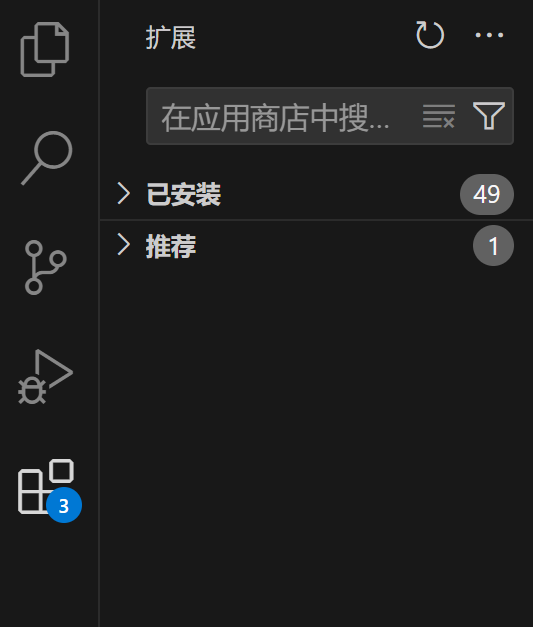
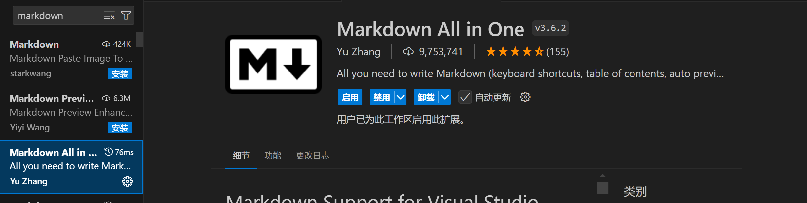

## Markdown 插件

### 安装插件

- 打开扩展-应用商店 
- 搜索markdown，安装图示插件 

### 使用方法

#### 自动生成目录

- 打开命令面板：  
  Windows/Linux: Ctrl + Shift + P  
  macOS: Cmd + Shift + P

- 搜索并选中 Markdown All in One：Create Table of Contents
- Markdown All in One 会自动分析你的文档结构，并生成相应的目录

#### 添加段落编号

- 在命令面板中搜索并选中 Markdown All in One：Add/Update section numbers

#### 预览

- 点击右上角带放大镜的书本图案，或使用快捷键：  
  Windows/Linux: Ctrl+Shift+V  
  macOS: Cmd+Shift+V  

#### 导出为pdf

- 安装 Markdown Preview Enhanced 扩展

- 右键预览界面，选择"Open in browser"，然后利用chrome浏览器将网页转换为pdf文件
